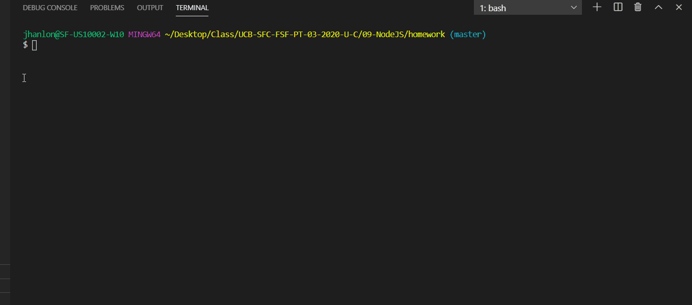

# Readme Generator

## Table of Contents

    - Description
    - Installation
    - Usage
    - Contributors
    - Tests
    - Questions

## Description

    undefined

## How to install

    undefined

## Intended Usage

    This project is used to create Readme files for github projects

## Contributors

    only me

## Tests

    none

## Questions

    undefined

Email:null
